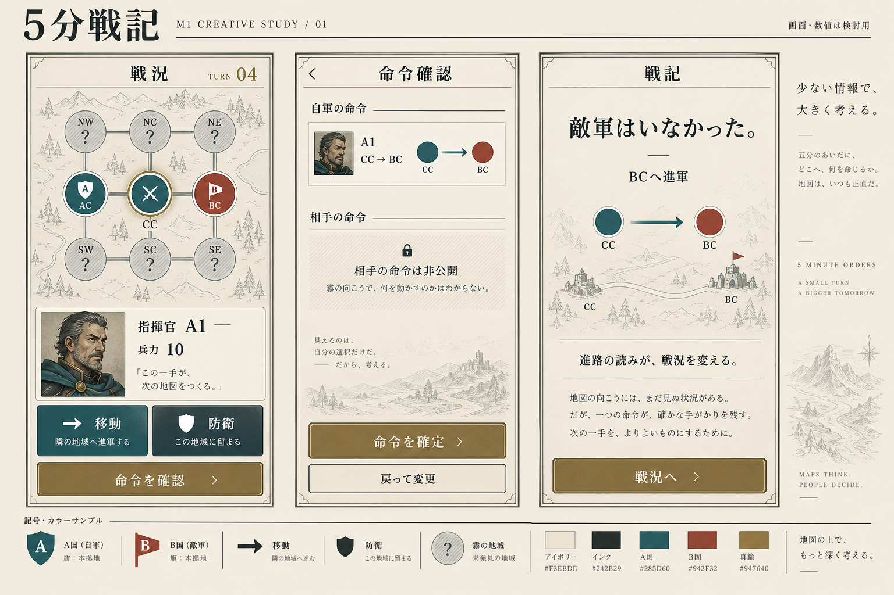

# M1 クリエイティブ 01 — 軍議の手帳

作成日: 2026-09-09 / 状態: **方向性の提案・ゲーム未組み込み**。
勝利条件を含む[SPEC 002](../../specs/002-m1-rules.md)の未決定ルールは未採用のまま。
本資料の画面や兵力10は検討用であり、動作するゲーム画面や確定仕様ではない。

## 見本

[紋章・アイコン・地図接続のSVG見本](assets/field-kit.svg) /
[指揮官A1の肖像](assets/commander-a1.png) / [生成プロンプト](PROMPTS.md)

## 表現の狙い

戦況を読む時間は静かに、命令は明確に、結果の一文で感情が動く画面を目指す。
温かい紙色、墨色の文字、細い地図線、控えめな肖像を組み合わせる。
山や城の装飾は雰囲気のみ。地形効果・城塞ルールを導入したことにはしない。
国家名や指揮官の伝記は作り込まず、A・B・A1を検討用識別子として使う。

## スタイル指定案

| 用途 | 値 | 使い方 |
| --- | --- | --- |
| 紙 | `#F3EBDD` | 基本背景。文字の背後は模様を弱める |
| 墨 | `#242B29` | 本文、境界、アイコン |
| A国 | `#285D60` | 盾型＋Aラベルを併用 |
| B国 | `#943F32` | 旗型＋Bラベルを併用 |
| 真鍮 | `#947640` | 選択枠・区切り等のアクセント。小さい本文の色に使わない |
| 不明 | 紙＋墨の破線・斜線・`?` | 無人と不明を明確に区別する |

国家色は所属を表し、成功・失敗には流用しない。陣営を入れ替えてもA・Bの記号は固定する。
防衛の盾にはチェックを付け、A国の盾にはAを付ける。単独アイコンだけで命令を説明しない。
選択は二重枠、確定は鍵＋「確定済み」、未入力は文字で補う案。

390×844の既存基準に対する実装時の目安:

- 本文16〜18、補助情報14以上、画面見出し24、結果の主見出し28〜32。
- 本文と操作ラベルは日本語ゴシック系、タイトル・戦記の主見出しだけ明朝系を検討。
- 行間1.5程度、左右余白16、主要操作の高さ48以上。セーフエリアは別途確保する。
- 肖像は64〜80角から検証し、3指揮官の一覧では肖像より位置と命令を優先する。
- これらは仮の寸法案。生成ボードはピクセル単位の画面設計ではない。

日本語フォントの製品選定・同梱はまだ行っていない。生成画像内の文字はフォント素材ではない。
UI実装時に再配布可能なフォントとライセンスを同梱し、上記サイズで実画面を確認する。

## 3画面の情報順序と文案

| 画面 | 情報の順序 | 主操作 |
| --- | --- | --- |
| 戦況 | ターン → 観測地図 → 選択指揮官・位置・兵力 → 命令 | 移動／防衛、命令を確認 |
| 命令確認 | 自軍の命令一覧 → 未入力の扱い → 確定の意味 | 命令を確定／戻って変更 |
| 戦記 | 何が起きたか → 自軍の行動結果 → 更新された戦況 | 戦況へ。終局時の操作は勝利仕様の採用後に設計 |

文案は短く、観測から裏付けられる出来事だけを述べる。

- 無人領地への到着例: 「敵軍はいなかった。」「BCへ進軍」
- 防衛命令例: 「この地で待ち構える。」
- 確定前の説明案: 「確定後は、このターンの命令を変更できません。」
- 未入力が防衛になる案を採る場合: 「未入力の指揮官は防衛します。」
- 確定済みの表示案: 「命令は確定済みです。」
- 不明情報: 「現在は不明」。過去の目撃を併記するなら「最終確認：第3ターン」。

「敵が逃げた」「敵は陽動を狙った」のような、観測で分からない意図を断定しない。
首都占領の文案はD01採用後に作る。画像中のBC進軍例は終局画面の仕様を定めない。

## 生成ボードを実装へ渡す際の修正点

- 地図の線や霧は構図の見本。接続はSVGの9領地グラフ／SPECを正とし、
  ボードの線をトレースして実装しない。
- 中央の自軍からの隣接視界と、画像の霧の配置は整合したゲーム状態ではない。
  D05採用後にObservationから表示する。画像をルールの解決例に使わない。
- 右端の英語コピー、人物の台詞、細い装飾文字は雰囲気の探索。実画面では削減する。
- 画像中の色コードに表記揺れがあるため、本書の値を正とする。
- 確定ボタンの真鍮背景は見本。実装では墨色背景＋紙色文字等で読みやすさを確保する。
- ボード内肖像と個別肖像は別生成。個別素材として利用するのは `commander-a1.png`。

## 納品物と次の制作

| ファイル | サイズ | 状態・用途 |
| --- | --- | --- |
| `m1-direction-board.png` | 1536×1024 | 3画面の雰囲気と構成を比較する生成画像 |
| `assets/commander-a1.png` | 1254×1254 | 指揮官1点、紙色背景付きPNG。仮肖像 |
| `assets/nation-a.svg`, `assets/nation-b.svg` | 64×64 viewBox | 盾A／旗B。新規作成のベクター紋章 |
| `assets/order-move.svg`, `assets/order-defend.svg` | 24×24 viewBox | 移動・防衛 |
| `assets/fog-unknown.svg`, `assets/order-locked.svg` | 24×24 viewBox | 不明・確定 |
| `assets/capital.svg`, `assets/chronicle.svg` | 24×24 viewBox | 首都・戦記 |
| `assets/field-kit.svg` | 1120×1120 viewBox | 色・記号・正確な9領地接続のレビュー用シート |

原本は仕様検討資料としてこのディレクトリに保存。ゲーム採用時に必要な素材だけ
`game/assets/`へ移し、import sidecarを生成して台帳を更新する。
フォント・音・追加肖像・地図背景の本制作は画面とルールが固まってから追加する。

確認: 生成ボードと肖像を目視確認。SVGは全9ファイルのXML構文と、
ローカルでレンダリングした素材シートの全紋章・アイコン・地図接続を確認済み。
文書のローカルリンクと `git diff --check` も確認済み。
ゲーム操作・390×844での日本語組版・実機のタップ・セーフエリアは未検証。
このセットの作成でM1-Aの仕様合意やM2の画面実装が完了したことにはしない。
